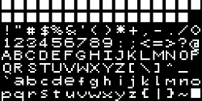

# Description pixel vector font
The font is constructed of a fixed set of vertices. The total is 8*8 pixels where each pixel is represented by 4 vertices = 256 vertices (VBO). Each pixel is displaced both vertically and horizontally (i.e. a gap). Each pixels is a Quad (2 triangles).

Each alpha character is defined by 8 bytes. Each byte is a row of bits and each bit represents one of the pixels either on or off. Each bit represents one a Quad. If the pixel is "1" the corresponding Quad is displayed.

Each character is 8*8 = 64 Quads. So for each char a list of indices are collected that represent which quads are displayed. All characters are defined statically.

## Atlases
An Atlas works by collecting *Shapes* where each shape contains a collection of vertices and indices.

Once all shapes are collected you need to transfer the vertices and indices into an OpenGL configuration. This is called *burning* and is done by a two step process: *shake* and *bake*.

## Shake
Shaking a shape is the process of copying the shape vertices and indices into to an OpenGL compatible **backing** arraya which are later copied into an OpenGL buffers.

## Bake
An Atlas is a collection of "shapes" and when all shapes are added the *bake* process should start. This is where the **backing** arrays are transferred to OpenGL buffers via the bind methods.

Finally the backing arrays are cleared as they are not needed once the engine is running.

|------------------| 0   <-- maps 0
|                  |
|     shapeA       |   vertices
|                  |
|------------------| 12  <-- maps 0
|     shapeB       |
|                  |
|------------------| 35  <-- maps 23
|                  |
|      font        |
|     vertices     |
|                  |
|------------------|

|------------------|
|                  |
|                  |
|                  |
|     geometric    |
|      shapes      |
|     indices      |
|------------------|
|                  |
|                  |
|      font        |
|     indices      |
|                  |
|------------------|

```
Name: UnitRectangle
indicesByteOffset: 0   <-- in the vertex buffer this is the offset in bytes
Total indices: 6
Total vertices: 4
Total vertex floats: 12
Size of GLuint: 4  >--------------------------------V
Next indicesByteOffset: 24   <-- 6 * sizeof(int) = 6 * 4 = 24
i: 0, offset: 0                                            |
i: 3, offset: 3                                            |
i: 1, offset: 1                                            |
i: 1, offset: 1                                            |
i: 3, offset: 3                                            |
i: 2, offset: 2                                            |
verticesBlockOffset: 0                                     |
Total vertices in backing: 12                              |
Next verticesBlockOffset: 4                                |
-------------------------------------------------          |
Name: UnitTriangle                 /-----------------------/
indicesByteOffset: 24              |
Total indices: 3   >---------------|--------|
Total vertices: 3                  |        |
Total vertex floats: 9             V        |
Size of GLuint: 4  >--------------------V   V
Next indicesByteOffset: 36    <-- 24 + (4 * 3) = 36
i: 0, offset: 4
i: 1, offset: 5
i: 2, offset: 6
verticesBlockOffset: 4
Total vertices in backing: 21
Next verticesBlockOffset: 7
-------------------------------------------------
Name: UnitHLine
indicesByteOffset: 36
Total indices: 2
Total vertices: 2
Total vertex floats: 6
Size of GLuint: 4
Next indicesByteOffset: 44    <-- 36 + (4 * 2) = 44
i: 0, offset: 7
i: 1, offset: 8
verticesBlockOffset: 7
Total vertices in backing: 27
Next verticesBlockOffset: 9
-------------------------------------------------
Name: UnitVLine
indicesByteOffset: 44
Total indices: 2
Total vertices: 2
Total vertex floats: 6
Size of GLuint: 4
Next indicesByteOffset: 52     <-- 44 + (4 * 2) = 52
i: 0, offset: 9
i: 1, offset: 10
verticesBlockOffset: 9
Total vertices in backing: 33
Next verticesBlockOffset: 11
-------------------------------------------------
Name: UnitPlus
indicesByteOffset: 52
Total indices: 4
Total vertices: 4
Total vertex floats: 12
Size of GLuint: 4
Next indicesByteOffset: 68   <-- 52 + (4 * 4) = 68
i: 0, offset: 11
i: 1, offset: 12
i: 2, offset: 13
i: 3, offset: 14
verticesBlockOffset: 11
Total vertices in backing: 45
Next verticesBlockOffset: 15
-------------------------------------------------
```

## Pixel Bitmap Font (PV)
A *pixel* is a quad within a grid of 8x8 = 64 quads. Each "1" bit in the bitmap means we create a group of indices for that pixel.

Note: in variations of this font technique we may create indices groups for "0" bits as well that may have a darker shade. TODO for the future!

PV Fonts function much like geometric shapes except that there is a single group of vertices that represent an 8x8 grid of Quads, but there is an indices *group* for each character. Each group has a starting index that is used during rendering of a single pixel. An example, from the "!" character is that there is five pixels "On" which means the group has 5 quads rendered.

So for each character, we iterate through each byte's bits and determine which quads are displayed. This means we calculate 4 indices for each "pixel" and group them together, and we do this 64 times for each character. Note: these are only calculated once and cached.

Then for the next character we generate a new group of indices. We continue until all characters have a group of indices. Note all characters are done upfront, we don't build indices as we need them, they are all cache in an EBO buffer.

An example for the number 1 if represented by a vertical line would look like this:
00000000
00011000
00011000
00011000
00011000
00011000
00011000
00000000

Above we would have 12 indices groups.

Then for the next char, for example 0, we would pack right next to it 12+16=28 indices.
00000000
01111110
01100110
01100110
01100110
01100110
01111110
00000000

So the first char "1" is at offset *off1* and "0" is at offset *off2*. If the offset starts a 0 then *off2* is at 11, and the next char would be at offset 28+11=49 thus 48.


Note: All vertices and indices are *packed* into the same atlas that may also have geometric shapes.

An example, of an EBO grouping
```
vvvv_vvvv_vvvv_vvvv_vvvv_vvvv_vvvv_vvvv_vvvv_vvvv_vvvv_vvvv_vvvv_vvvv_vvvv_vvvv_vvvv_vvvv
|--------------------- A --------| |-------------------------- B -----------------------|
0 offset                           (4*7)=28 offset
```

Another way to look at it is: The entire font has a single set of vertices. These vertices represent the entire 8*8 grid of quads and each quad is 4 vertices which totals 256 vertices.

### "<span style='color: red'>!</span>" character
Then, for each character there is a collection of indices that represent all visible "pixels". For example, "!" has 5 visible pixels (aka quads) based on the font definition file *dark_rose.hpp* and specifically ```0x0808080800080000, /* ! */``` which looks like this:

Note: because OpenGL default +Y axis is downward we need to iterate opposite of what is shown below because the font character would be upside down.

    OpenGL's +Y axis is downward
               -y
                |
                |
                |
    -x ------------------- +x
                |
                |
                |
               +y

```sh
                                             0x0808080800080000  <== "!"
           01234567    0 1 2 3 4 5 6 7         | | | | | | | |
byte: 08 = 00001000    □ □ □ □ ■ □ □ □ <-------+ | | | | | | |             ^
byte: 08 = 00001000    □ □ □ □ ■ □ □ □ <---------+ | | | | | |             |
byte: 08 = 00001000    □ □ □ □ ■ □ □ □ <-----------+ | | | | |             |
byte: 08 = 00001000    □ □ □ □ ■ □ □ □ <-------------+ | | | |             | Iterate in
byte: 00 = 00000000    □ □ □ □ □ □ □ □ <---------------+ | | |             | this direction
byte: 08 = 00001000    □ □ □ □ ■ □ □ □ <-----------------+ | |             |
byte: 00 = 00000000    □ □ □ □ □ □ □ □ <-------------------+ |             |
byte: 00 = 00000000    □ □ □ □ □ □ □ □ <---------------------+
```

You can see that column 4 has all the visible pixels (i.e. 1s).
This means that "!" has 5 * 6 = 30 indices.

### "<span style='color: red'>"</span>" character
```sh
           01234567    0 1 2 3 4 5 6 7
byte: 28 = 00101000    □ □ ■ □ ■ □ □ □
byte: 28 = 00101000    □ □ ■ □ ■ □ □ □
byte: 00 = 00000000    □ □ □ □ □ □ □ □
byte: 00 = 00000000    □ □ □ □ □ □ □ □
byte: 00 = 00000000    □ □ □ □ □ □ □ □
byte: 00 = 00000000    □ □ □ □ □ □ □ □
byte: 00 = 00000000    □ □ □ □ □ □ □ □
byte: 00 = 00000000    □ □ □ □ □ □ □ □
```
This means that """ has 4 * 6 = 24 indices.

### "<span style='color: red'>#</span>" character
```sh
           01234567    0 1 2 3 4 5 6 7
byte: 00 = 00000000    □ □ □ □ □ □ □ □
byte: 28 = 00101000    □ □ ■ □ ■ □ □ □
byte: 7c = 01111100    □ ■ ■ ■ ■ ■ □ □
byte: 28 = 00101000    □ □ ■ □ ■ □ □ □
byte: 7c = 01111100    □ ■ ■ ■ ■ ■ □ □
byte: 28 = 00101000    □ □ ■ □ ■ □ □ □
byte: 00 = 00000000    □ □ □ □ □ □ □ □
byte: 00 = 00000000    □ □ □ □ □ □ □ □
```

This means that "#" has 16 * 6 = 96 indices.

With these 3 characters the buffer-space sent to OpenGL looks like this:
```
       !               "                         #
0              19 20          35 36                         99
|---------------| |-----------|  |---------------------------|


So our character map should be like this
{"!",00},
{'"',20},
{"#",36}...etc.
```

Each "1/0" indexes into the same vertex collection, but note, those indices are in local-space and once the *burn* shake subprocess takes place they will be converted into buffer-space.

# Darkrose font
[DarkRose Font](https://opengameart.org/content/8x8-ascii-bitmap-font-with-c-source)

[Zip file](../common/assets/fonts/darkrose_font.zip)


# Gemini generated Vector font
```
'z' indicesOffset size: 0, vertices: 0.4, 0.4, 0, 0, 0.4, 0, 0.4, 0, 0, 0, 0, 0, 
Indices: 6 :: 0, 1, 2, 3, 4, 5, 
Pair Data:: {6, 0}
Next verticesBlockOffset: 4
------------------------------------------------
'y' indicesOffset size: 6, vertices: 0, 0.4, 0, 0.2, 0, 0, 0.4, 0.4, 0, 0.4, -0.1, 0, 
Indices: 6 :: 4, 5, 6, 7, 8, 9, 
Pair Data:: {6, 24}
Next verticesBlockOffset: 8
------------------------------------------------
'x' indicesOffset size: 12, vertices: 0, 0.4, 0, 0.4, 0, 0, 0, 0, 0, 0.4, 0.4, 0, 
Indices: 6 :: 8, 9, 10, 11, 12, 13, 
Pair Data:: {6, 48}
Next verticesBlockOffset: 12
------------------------------------------------
'w' indicesOffset size: 18, vertices: 0, 0.4, 0, 0.1, 0, 0, 0.2, 0.2, 0, 0.3, 0, 0, 0.4, 0.4, 0, 
Indices: 7 :: 12, 13, 14, 15, 16, 17, 18, 
Pair Data:: {7, 72}
Next verticesBlockOffset: 17
------------------------------------------------
'v' indicesOffset size: 25, vertices: 0, 0.4, 0, 0.2, 0, 0, 0.4, 0.4, 0, 
Indices: 4 :: 17, 18, 19, 20, 
Pair Data:: {4, 100}
Next verticesBlockOffset: 20
------------------------------------------------
'u' indicesOffset size: 29, vertices: 0, 0.4, 0, 0, 0, 0, 0.4, 0, 0, 0.4, 0.4, 0, 
Indices: 6 :: 20, 21, 22, 23, 24, 25, 
Pair Data:: {6, 116}
Next verticesBlockOffset: 24
```

## Text
To render text we make draw element calls using the group offsets. For example, to render "Hello", this would require 5 draw calls. Each call would translate each character based on an accumulating offset, otherwise each char would appear on top of the other.

When a Static Text Node is created we calc as much as possible up front, for example, for each character we get the offset and save it in a static array. This saves a lookup and we simply iterate the array when drawing.

